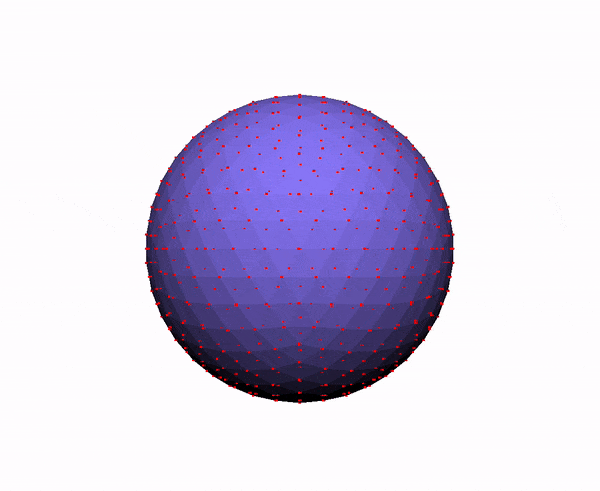
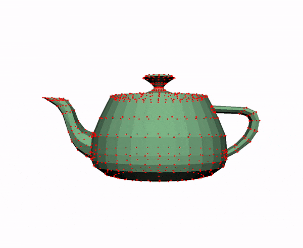
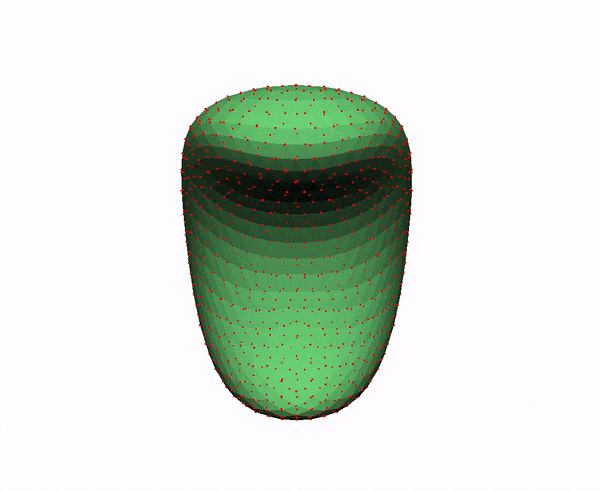
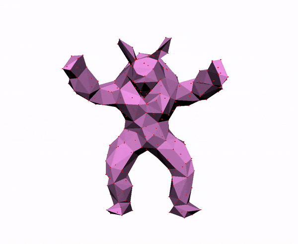
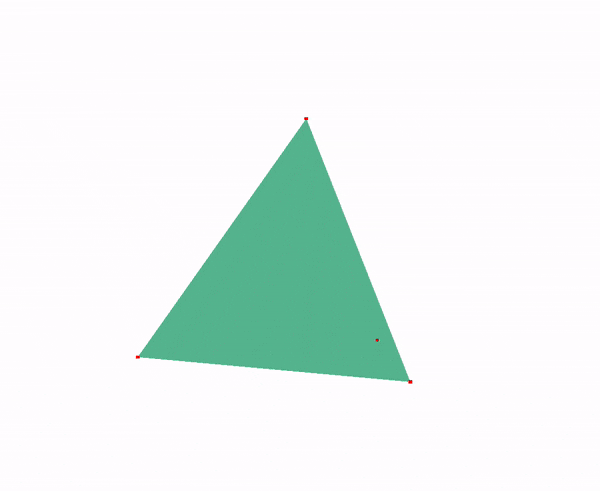

# Assignment 4: As-Rigid-As-Possible Surface Modeling (ARAP)

**Released:** 3/18/24

**Due:** 4/5/24 @ 11:59pm EST

In this assignment, you will implement a system for user-interactive deformation of 3D meshes. In your system, mesh vertices can be re-positioned by clicking and dragging. Your system will update the rest of the mesh in response to these user interactions such that it moves as-rigidly-as-possible (i.e. the deformation it exhibits is close to a rigid transformation). The end result is a deformation that looks physically-plausible, as if the mesh has an underlying rig / skeletal armature.

To achieve this goal, you will need to formulate the deformation process as an optimization problem, in which you will alternate between estimating the best-fit rigid transformation for each mesh vertex and solving a sparse linear system to find new mesh vertex positions.

## Relevant Reading

- The lecture slides!
- [As-Rigid-As-Possible Surface Modeling](https://igl.ethz.ch/projects/ARAP/arap_web.pdf) on the mathematics behind the ARAP algorithm.

## Requirements

This assignment is out of **100 points**.

Your must implement exactly one feature: the algorithm described in the ARAP paper. That means, for each user interaction, your program must perform the following steps:

- [Initialization](#initialization) **(35 points)**
- [Iterative solving](#iterative-solving) **(45 points)**

You will be graded for inclusion of the following as well:

- [README](#readme) **(5 points)**
- [Example videos](#example-videos) **(10 points)**

This sums to **95 points**. To score **100 points** (or more!), you’ll need to implement some [extra features](#extra-features).

### Initialization

1. Set an initial value for the new vertex positions $p'$. Use the previous vertex positions $p$ for this. **(0 points)**
2. Build the $L$ matrix. **(25 points)**
   - Determine the one-ring neighbors of each vertex;
   - Calculate the cotangent weight $w$ for each vertex;
   - Fill in the $L$ matrix entries.
3. Apply user constraints by deleting rows/columns from $L$. **(5 points)**
4. Precompute the decomposition of the $L$ matrix. **(5 points)**
   - If you unnecessarily recompute this decomposition, you will lose points for inefficiency.

### Iterative Solving

1. Determine the best-fit rotation transformations $R$ for the moved points $p'$ from original points $p$. **(20 points)**
2. Optimize the positions $p'$ given $p$ and $R$ by solving a sparse linear system. You will need to update the right-hand side of the equation accordingly. **(25 points)**

### README

Your README **(5 points)** should describe:

1. How to run your program, such as how to load a specific mesh; and
2. _Briefly_, all the features your code implements, including any known bugs.
   - E.g.: "I implemented ARAP ... and affine progressive meshes ... however, my program doesn't work in these specific cases: ..."

You should also have all the [example videos](#example-videos) described in the next section embedded in your README.

### Example Videos

For this project, we ask that you demonstrate to us that your program achieves the following behavior specifications. You will do so by providing ≥1 video(s) per specification point below.

| Program Specification                                                                                                                                                     | Our Example                          |
| :------------------------------------------------------------------------------------------------------------------------------------------------------------------------ | :----------------------------------- |
| Anchoring exactly one point, then moving that point, results in perfectly rigid motion (mostly translation, though some rotation for smaller meshes is acceptable).       |       |
| Anchoring exactly two points, then rotating one point around the other at a fixed distance, results in perfectly rigid rotation.                                          |       |
| Deformations are "permanent"; i.e. un-anchoring previously moved points leaves the mesh in its deformed state, and further deformations can be made on the deformed mesh. |         |
| You should be able to make the armadillo wave.                                                                                                                            |    |
| Attempting to deform `tetrahedron.obj` should not cause it to collapse or behave erratically.                                                                             |  |
| Attempting to deform a (large) mesh like `bunny.obj` or `peter.obj` should not cause your code to crash.                                                                  |        |

  
How should I generate these example videos?

We suggest screen-recording the [interactive viewer](#interactive-viewer) provided in [the stencil code](#resources).

To embed these videos into your READMEs, you can convert these into animated GIFs (using `ffmpeg` or an online tool like [ezgif](https://ezgif.com)), then embed them in Markdown like so:

``

### Extra Features

Each of the following features that you implement will earn you extra points. The features are ordered roughly by difficulty of implementation.

- Parallelize your code **(5 points)**
  - There are multiple opportunities to exploit parallelism. For instance, you could solve the linear systems for each coordinate (x, y, z) in parallel.
- Improved interactivity **(8 points)**
  - Implement some other way(s) to interact with the mesh beyond constraining/dragging single vertices.
  - You could also look into allowing direct specification of rotations in addition to translations (see the "Rotation-Propagation" paragraph on page 6 of the paper).
  - Please record a video of how you interact with the mesh.
- Affine progressive meshes **(10 points)**
  - The ARAP optimization can become slow for very high-resolution meshes. To get around this problem, one can try to solve the optimization on a lower-resolution mesh, and then interpolate the result back to the high-resolution mesh.
  - See Section 3.2 of [this paper](https://www.dgp.toronto.edu/~hsuehtil/pdf/cubeStyle_high.pdf) for one way to do this. You will need to re-use your mesh simplification code from the Mesh assignment.
  - You may find some example high-resolution meshes [here](https://graphics.stanford.edu/data/3Dscanrep/).
  - Please record a video interacting with the high-resolution meshes.
- Modified optimization objective **(15 points)**
  - One can modify the basic ARAP optimization objective function to achieve other types of deformation.
  - For example, [this paper](https://www.dgp.toronto.edu/~hsuehtil/pdf/cubeStyle_high.pdf) describes how adding an L1 regularizer to the objective produces 'cubified' meshes.
  - Be aware that changing the objective may well change the method(s) you need to use to solve the resulting optimization problem.
  - Please show at least 2 pairs of images comparing your modified ARAP results and the original results. 
- Something else!
  - This list is not meant to be exhaustive--if you’ve got another advanced feature in mind, go for it! (though you may want to ask a TA or the instructor first if you’re concerned about whether the idea is feasible)

**Any extra features you implement must be mentioned in your README, and each feature must be demonstrated in one or more videos.**

## Grading

We will initially grade your project based solely on your README, example videos, and code.

We will then follow up with a short in-person grading session to resolve any outstanding issues.

You can help us make grading go smoother by providing excellent [example videos](#example-videos), to prove to us that your program meets our specifications~!

## Resources

The stencil code is quite bare-bones: besides the main function, it provides code to load `.obj` files into a simple mesh representation (a list of vertices and a list of faces) and save that representation back to an `.obj` file. It also provides an interactive viewer for visualizing (and manipulating the vertices of) meshes.

You’ll have to implement everything else: building the sparse linear system, any supporting data structures you need, etc.

To test your program, you may use the `.obj` files in `/meshes`. You may also use any other 3D models you like.

  
Note about meshes with boundaries

You do not need to support meshes with boundaries for any part of this assignment. That is to say, you can always assume that every edge has two adjacent faces, so you won't have to worry about special-casing for edges on the boundary.

All the meshes provided in the stencil satisfy this property. If you choose to use any other meshes, it will be on you to make sure that this property is satisfied (else, your code might break).

### Where To Start

You'll want to look at `src/arap.cpp` to get started, as that's the only file you'll (definitely) need to change. You might also want to look at `src/glwidget.cpp`, if you're interested in adding new interactivity/controls to the program.

### Interactive Viewer

Speaking of controls, here's how you can interface with the interactive viewer:

- You start in first-person camera mode:
  - `WASD` to move, `left-click` and drag to rotate
  - `R` and `F` to move vertically up and down
- `C` to change to orbit camera mode
- `Right-click` (and, optionally, drag) to anchor/un-anchor points.
  - `Left-click` an anchored point to move it around
- Minus (`-`) and equal (`=`) keys (click repeatedly) to change the size of the vertices

### Solving Sparse Linear Systems In Eigen

You'll want to look at [this page](https://eigen.tuxfamily.org/dox/group__TopicSparseSystems.html) in the Eigen documentation. We recommend using either the `SimplicialLLT` or `SimplicialLDLT` solvers, as they are specialized to be faster for symmetric positive definite (SPD) matrices (which your $L$ matrix is).

## Submission Instructions

Submit your Github repository to the "ARAP" assignment.

## Implementation & Debugging Tips

- Use `const` and `assert` wherever possible.
- Check for uninitialized values.
- Use Qt Creator's debugger.
- The cotangent function can be negative, be sure to use the **positive** cotangent weights (the absolute value of the cotangent).
- Verify that your $L$ matrix is **positive semi-definite** (has eigenvalues and a determinant greater than or equal to zero)
- We provided helper functions in `graphics/shape.h`, all the public member function should be enough for you to complete the minimum requirement without having to modify our helper classes.
- **REMINDER: Your code will run much faster if you compile in Release mode ;)**
